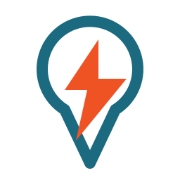

# NDW Charging Point (DOT-NL) for Home Assistant

<br clear="left">

A Home Assistant custom integration that reports live status (`available` /
`charging` / `outoforder` / ...) for Dutch public EV charging points, sourced
from [NDW's National Access Point open data feed](https://opendata.ndw.nu/)
(DOT-NL). Every Dutch charge point operator - Allego included - is legally
required (EU AFIR) to publish live OCPI status there, so this works for any
public charge point in the Netherlands, not just Allego.

No API key, no registration, no rate limit - it's a free public dataset.

## Why not Allego's or oplaadpalen.nl's API?

Both are informal, reverse-engineered endpoints (not officially supported)
that have broken before: Allego shut down the endpoint once it got
discovered, and oplaadpalen.nl's proxy stopped working as of March 2026 per a
[Home Assistant Community thread](https://community.home-assistant.io/t/integration-request-allego-public-ev-charger-status-public-api-cloud-polling/751759).
NDW's feed is the official, government-mandated source and is what those
workarounds were ultimately proxying anyway.

## How it works

- You give it an NDW **Location ID** in the config flow (see below for how
  to find one).
- Every poll (10 min by default, configurable down to 2 min in Options), it
  downloads and parses the national feed (~18MB gzipped) and extracts that
  one location's record.
- One sensor is created per EVSE (charge point) found at that location.

## Installation

### Via HACS (recommended)

This repo isn't in HACS's default store, so add it manually as a custom
repository:

1. HACS -> the "..." menu (top right) -> **Custom repositories**.
2. Repository: `https://github.com/MaiorDomus/ndw-charging-ha`, category: **Integration**.
3. Find "NDW Charging Point (DOT-NL)" in HACS and install it.
4. Restart Home Assistant.
5. **Settings -> Devices & Services -> Add Integration -> "NDW Charging Point"**.

### Manual

Copy `custom_components/ndw_charging/` into your Home Assistant config
directory, restart Home Assistant, then go to
**Settings -> Devices & Services -> Add Integration -> "NDW Charging Point"**.

To find a location's ID: download
`https://opendata.ndw.nu/charging_point_locations_ocpi.json.gz`, gunzip it,
and search the JSON array for the address or coordinates you want - each
entry's `"id"` field (e.g. `"NLLOC012345"`) is the Location ID to enter in
the config flow.

## Development

```bash
pip install -r requirements_test.txt
pytest tests/ -v
```

Tests mock the NDW feed download, so they run instantly and need no
network access. CI runs the same suite on every push/PR via
`.github/workflows/test.yml`.
